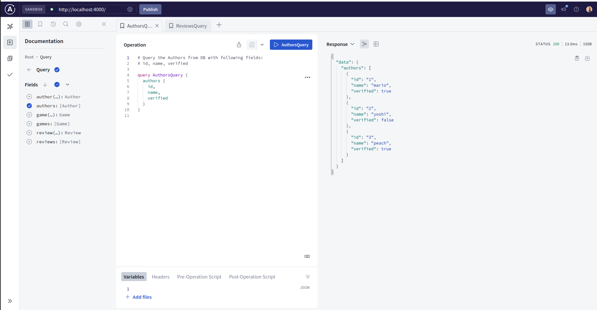

# Usage

Install packages using `yarn`:

```sh
yarn 
```

Run the server locally:

```sh
yarn dev
```

Open browser and digit `localhost:4000`. You should see the web interface of Apollo Client and from that you can launch queries




## Query on Apollo client


See related [doc](./docs/images/queries.md) 